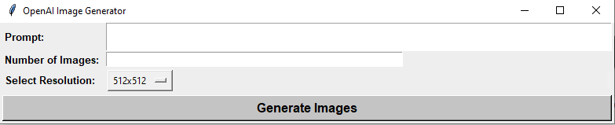

# OpenAI Image Generator (With GUI)

This is a Python script for generating images using the OpenAI API. The script uses tkinter for building the GUI and the requests and json libraries for making requests and handling responses.

## Requirements

- Python 3
- tkinter
- requests
- json
- Pillow
- openai

## Setup

1. Install the required libraries by running `pip install tkinter requests Pillow openai`
2. Obtain an API key from the [OpenAI website](https://platform.openai.com/account/api-keys) and replace `"Your API KEY"` in the code with your API key.

## Usage

1. Run the script using `python image_generator.py`
2. Enter your prompt in the `"Prompt"` text box
3. Enter the number of images you want to generate in the `"Number of Images"` entry box
4. Select the desired `resolution` from the drop-down menu
5. Click the `"Generate Images"` button
6. The generated images will be saved in the current working directory with filenames `image_1.jpg`, `image_2.jpg`, and so on.

## User Interface

## License

This script is licensed under the **MIT License**. Feel free to use and modify it as you wish.
